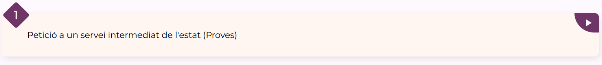
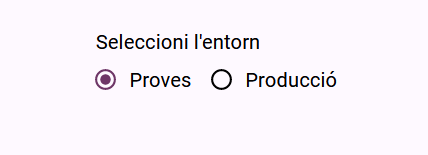
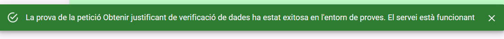
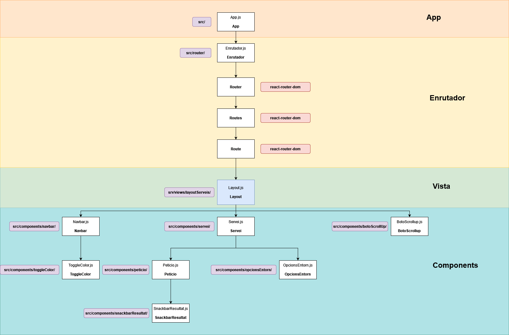

# Components
- Servei.  Té com a propietats un títol i el llistat amb la informació de les peticions, les quals són importades des del fitxer src/components/serveis/data/dadesServeis.js. Conté també l'estat d'entorn, que pot ser modificat des del component fill OpcionsEntorn.

  

  
- Petició. Component fill de serveis. Té la propietat de nom i la d'entorn, que provenen de les dades de component pare, Servei. L'entorn servirà per saber a quina funció del controlador cridar. Té 'estat de loading (boleà), resultatProva ("èxit" o "fall") i data d'última execució.
  
 

  

- Opcions Entorn. Component fill de Servei. Serveix per cambiar la propietat d'entorn a "proves" o a "producció". Aquesta propietat forma part del component servei i és passada a totes les peticions depenents del servei.
  
 

  

- Snackbar Resultat. Té la propietat boleana d'obert. Aquestá és posada a true per part del component pare Petició quan la petició deixa d'estar carregant. El text i color canvien en funció de si la propietat resultatProva (que és passada per props a través del component pare Petició) és "èxit" o "fall"
  
 

  

- Navbar. Conté el menú de navegació. Es pinta el llistat de rutes importat des de  src/router/rutesServeis.js.
  
 

  

- Toggle Color canvia el tema de colors mitjaçant la propietat tema, que pot ser clar o fosc. Si el valor és "fosc" s'afageix la classe fosc a la pseudoclasse root del css i se'n aplica la paleta de colors corresponent (Layout.css).
  

  

   - Botó Scroll up té la propietat booleana "visible" (canvia en funció de si l'usuari ha fer scroll cap avall) i el manejador d'events ScrollToTop per a què en clicar en el component, la pàgina es vegi des del principi.
  

  

# Estructura de l'aplicació

  

# Com afegir un nou servei

1. Afegir les dades d'un servei:
   A la ruta src/components/serveis/data/dadesServeis.js crear la constant seguint l'estructura d'exemple.

  

2. Exportar la constant creada al pas anterior:

  

1. Afegir servei a l'enrutador per a crear la ruta i la opció en el menú:
   Al fitxer src/router/rutesServeis.js, a la constant rutesServeis afegir un objecte amb els camps servei(adreçant a la constant creada en el pas 1 al fitxer de dadesServeis), el camp path (elegir valor del path a la url) i el camp nom a menú.

  

Fet això l'enrutador directament crearà una ruta al path especificat que renderitzarà la vista Layout amb les dades del servei (especificades a src/components/serveis/data/dadesServeis.js)

  

El Layout passarà la prop servei al component Servei, d'aquesta manera aquest coneix quin és el seu títol i quines són les seves peticions.

  

Després d'haver seguit els passos el resultat de la vista de la ruta /exemple (la que s'ha especificat a la propietat path de l'enrutador) será:

  

