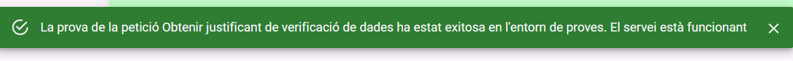

# Components
- Procediment.  Té com a propietats un títol i el llistat amb la informació de les peticions, les quals són importades des del fitxer src/components/procediment/data/dadesProcediments.js. Conté també l'estat d'entorn, que pot ser modificat des del component fill OpcionsEntorn.

  

  
- Servei. Component fill de Procediment. Té la propietat de nom i la d'entorn, que provenen de les dades de component pare, Procediment. L'entorn servirà per saber a quina funció del controlador cridar. Té 'estat de loading (boleà), resultatProva ("èxit" o "fall") i data d'última execució.
  
 

  

- Opcions Entorn. Component fill de Servei. Serveix per cambiar la propietat d'entorn a "proves" o a "producció". Aquesta propietat forma part del component procediment i és passada a totes les peticions depenents del procediment.
  
 

  

- Snackbar Resultat. Té la propietat boleana d'obert. Aquestá és posada a true per part del component pare Servei quan el servei deixa d'estar carregant. El text i color canvien en funció de si la propietat resultatProva (que és passada per props a través del component pare Servei) és "èxit" o "fall"
  
 

  

- Menu. Conté el menú de navegació. Es pinta el llistat de rutes importat des de  src/router/rutesServeis.js.
  
 

  

# Estructura de l'aplicació

  

# Com afegir un nou procediment

1. Afegir les dades d'un serprocedimentvei:
   A la ruta src/components/procediment/data/dadesProcediments.js crear la constant seguint l'estructura d'exemple.

  

2. Exportar la constant creada al pas anterior:

  

1. Afegir procediment al menur per a que sigui navegable i aparegui l'opció en el menú:
   Al fitxer src/menu/rutesProcediments.js, a la constant rutesProcediments afegir un objecte amb els camps procediment(adreçant a la constant creada en el pas 1 al fitxer de dadesServeis),  i el camp nom a menú.

  

Fet això es crearà un botó al menú amb la funció de renderitzar la vista Layout amb les dades del procediment (especificades a src/components/procediment/data/dadesProcediments.js)

-- A partir d'aquí pendent de canvi

  

El Layout passarà la prop procediment al component Procediment, d'aquesta manera aquest coneix quin és el seu títol i quins són els seus serveis.

  

Després d'haver seguit els passos el resultat de la vista de la ruta /exemple (la que s'ha especificat a la propietat path de l'enrutador) será:

  

